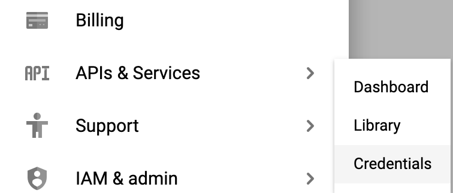
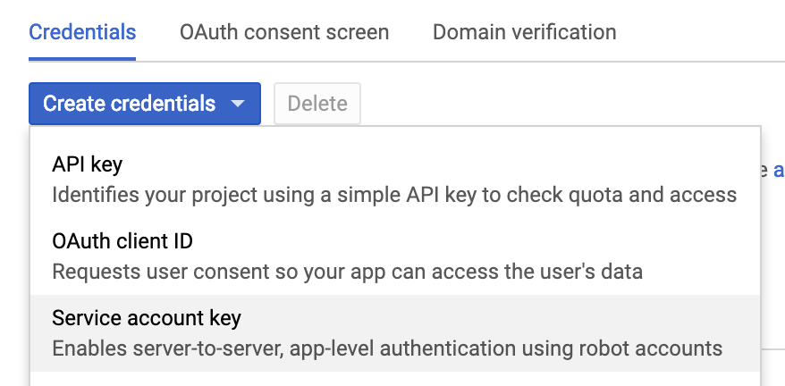
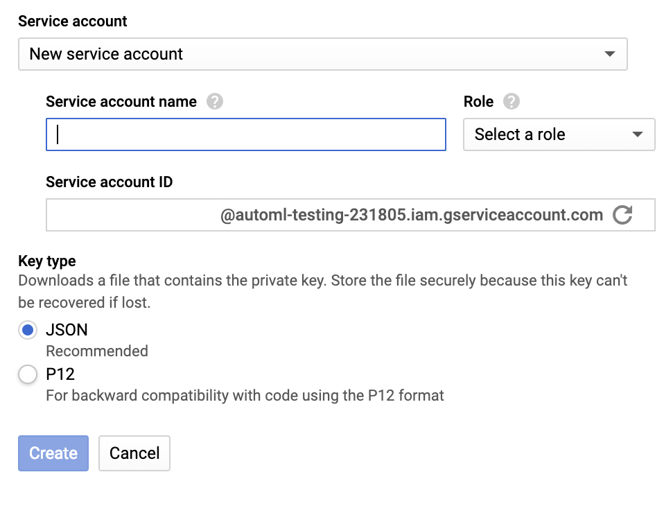
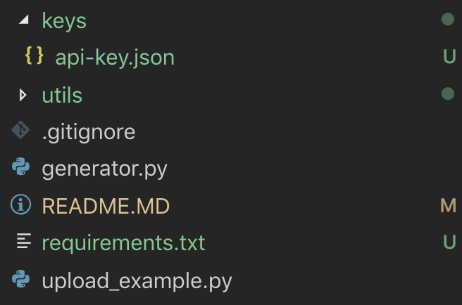
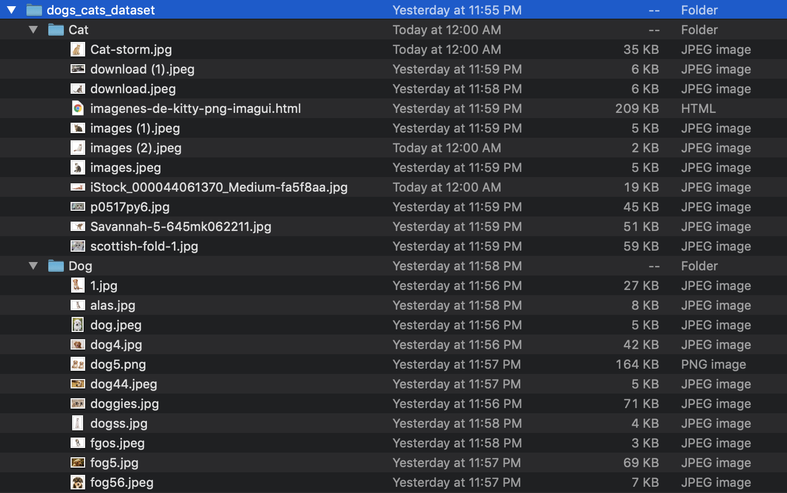
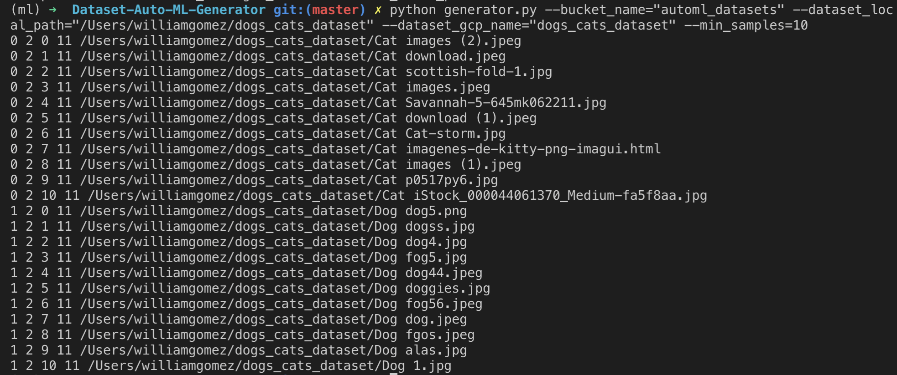
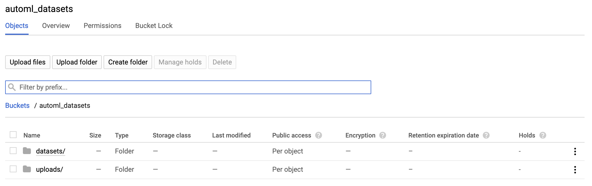
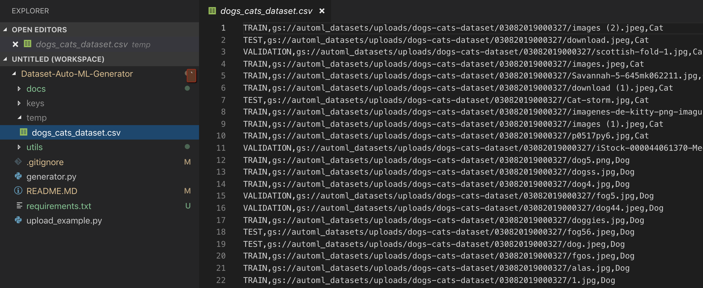
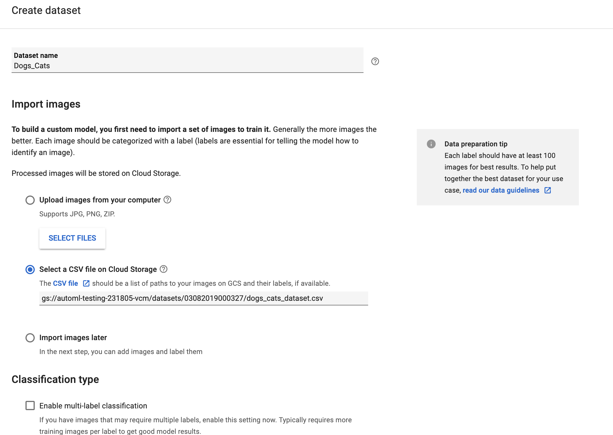
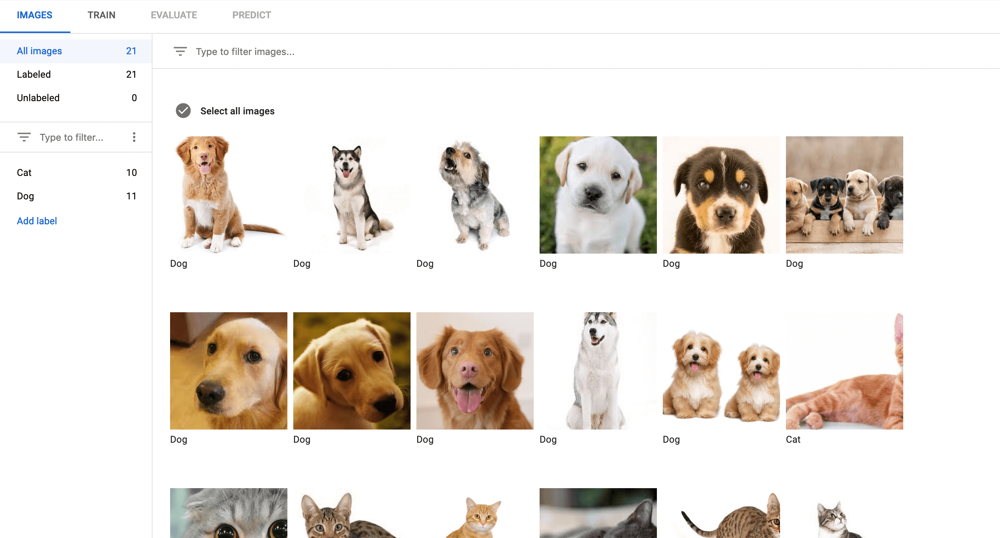

A utility to generate a dataset from a collection of image folders. It detects the folder structure and generate the classes in the dataset based on the folder hierarchy. The final result is a bunch of images uploaded to the [GCP storage](https://cloud.google.com/storage/) and a csv file. This csv file is also uploaded and can be accessed from [Auto ML](https://cloud.google.com/automl/) to import the dataset.

# How to use this?

1. First, you need to install the following packages:

```
pip install --upgrade google-api-python-client google-cloud-storage fire
pip install -r requirements.txt
```

2. Then, go to GCP credentials:

   

   Then, select the service account in the menu:

   

   Then, create the key and download the key:

   

   Create a folder in the root directory called 'keys' and store the key there with the name 'api-key.json':

   

3) Create a bucket in GCP to store all the files.

4. Build your dataset folder:
   Take into account that to train a class in Auto ML you need at least 10 images of a this class. The minimum recommended is 100 images. But you know the more the better.

   

5) Run the generator:

   ```
   python generator.py --bucket_name="automl-testing-231805-vcm" --dataset_loc
   al_path="/Users/williamgomez/dogs_cats_dataset" --dataset_gcp_name="dogs_cats_dataset" --min_samples=10
   ```

   

6. Go to your bucket:
   You will find two folders, one with all the images uploaded (uploads) and the second one with the csv of the dataset.
   

   You can also see csv generate in a temp folder in the root directory:

   

7) Import the dataset in Auto ML:
   Go to [Auto ML UI](https://cloud.google.com/automl/ui/vision) and click in "NEW DATASET".

   Set a dataset name.

   Select a CSV file on Cloud Storage.

   Add the path of the csv in the storage.

   

   Select Enable multi-label classification when you have more hierarchy in the folders, e.g.

   - Dogs
     - Schnauzer (Minimum 10 images inside)
     - Golden Retriver (Minimum 10 images inside)
   - Cats
     - American Curl (Minimum 10 images inside)
     - American Shorthair (Minimum 10 images inside)

   You will end with a dataset with the following classes: Dogs, Cats, Schnauzer, Golden_Retriver, American_Curl, American_Shorthair

Once your dataset is imported, you will see your images labelled.



Now, you can train your models!
